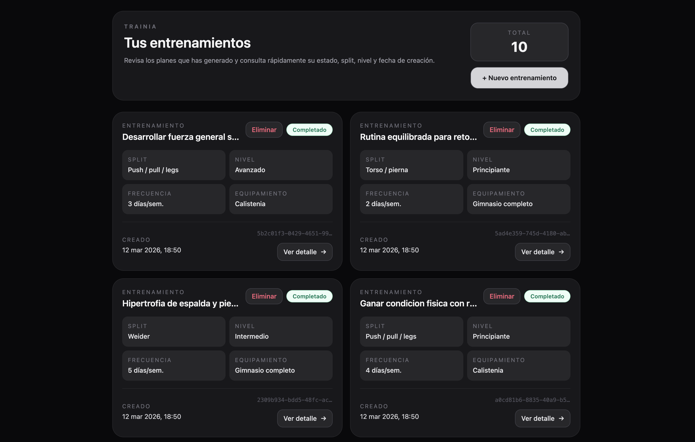
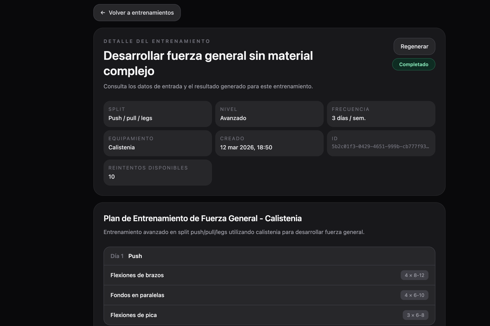
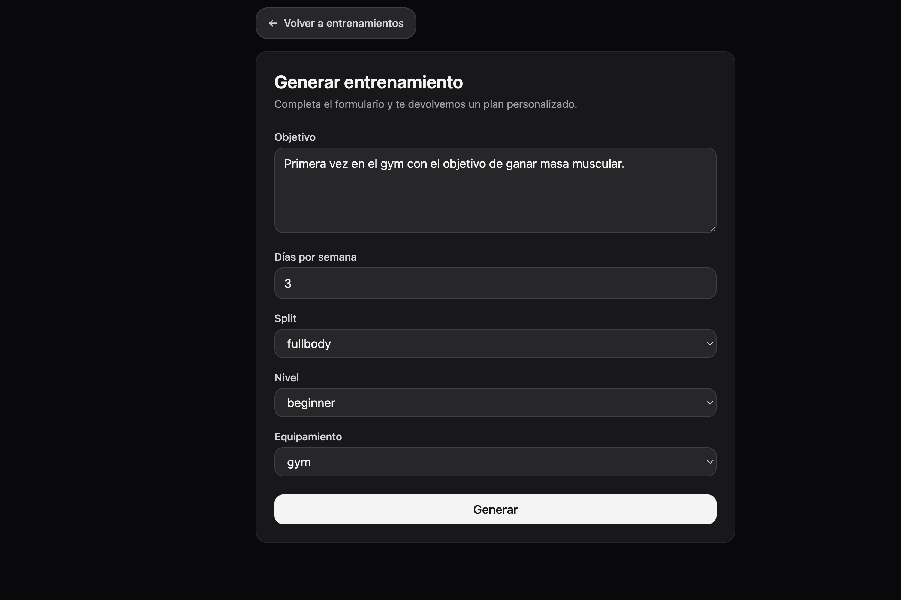

# TrainIA

Aplicación full-stack para generar planes de entrenamiento con IA, consultarlos desde un historial, ver su detalle y gestionarlos desde una interfaz moderna.

## Capturas
Añade aquí tus imágenes o GIFs cuando quieras dejarlo listo para portfolio.

```md



```

Huecos recomendados:
- `[CAPTURA_LISTADO]` historial principal con cards y paginación
- `[CAPTURA_DETALLE]` detalle completo con días y ejercicios
- `[CAPTURA_FORMULARIO]` formulario de creación
- `[GIF_GENERACION]` flujo crear -> generando -> detalle completado

## Demo funcional
- Crear un entrenamiento a partir de objetivo, frecuencia, split, nivel y equipamiento.
- Generación asíncrona del plan con seguimiento de estado.
- Historial paginado de entrenamientos guardados.
- Vista de detalle por entrenamiento.
- Regeneración de entrenamientos desde el detalle.
- Eliminación desde la lista con confirmación previa.

## Stack
- Frontend: Angular 21, Signals, Angular Router, Tailwind CSS 4
- Backend: Node.js, Express, Zod
- Base de datos: SQLite (`better-sqlite3`)
- IA: OpenAI API
- Tests: Vitest + Supertest

## Arquitectura
- `frontend/`
  Aplicación Angular standalone con tres flujos principales:
  - listado de entrenamientos
  - creación de un nuevo entrenamiento
  - detalle de entrenamiento

- `backend/`
  API REST que:
  - valida entradas con Zod
  - guarda solicitudes y resultados en SQLite
  - genera entrenamientos en segundo plano
  - expone endpoints para listar, consultar, regenerar y borrar

## Rutas de frontend
- `/trainings` listado principal
- `/trainings/new` formulario de creación
- `/trainings/:id` detalle del entrenamiento

## Endpoints principales
- `POST /api/trainings/generate`
- `GET /api/trainings`
- `GET /api/trainings/:id`
- `PUT /api/trainings/:id`
- `DELETE /api/trainings/:id`
- `GET /api/trainings/health`

## Puesta en marcha
### 1. Backend
```bash
cd backend
npm install
```

Crear un archivo `.env` en `backend/` con:

```env
PORT=3000
OPENAI_API_KEY=tu_api_key
```

Iniciar el backend:

```bash
npm run dev
```

### 2. Frontend
```bash
cd frontend
npm install
npm start
```

La app quedará disponible en:
- Frontend: `http://localhost:4200`
- Backend: `http://localhost:3000`

## Tests
### Backend
```bash
cd backend
npm test
```

Actualmente hay cobertura básica de integración para:
- health check
- generación válida e inválida
- consulta por id
- 404 por id inexistente
- listado paginado
- regeneración con control de intentos desde backend
- borrado exitoso
- conflicto al borrar si el entrenamiento está en `GENERATING`

### Frontend
```bash
cd frontend
npm test -- --watch=false
```

Actualmente hay pruebas mínimas para:
- render del listado con datos del servicio
- render del detalle tras cargar por id

## Datos demo
Para insertar entrenamientos de ejemplo en distintos estados:

```bash
cd backend
npm run seed:demo
```

Esto crea demos en estado:
- `GENERATING`
- `FAILED`
- `COMPLETED`

La app permite hasta `10` regeneraciones por entrenamiento.

Para eliminarlos:

```bash
cd backend
npm run seed:clear
```

## Qué demuestra este proyecto
- Diseño y consumo de una API REST real
- Modelado de estados asíncronos (`GENERATING`, `COMPLETED`, `FAILED`)
- Validación robusta en backend
- Integración de IA con salida estructurada
- Uso de Angular Signals para estado local
- Navegación entre vistas y detalle por recurso
- Regeneración controlada con límite de intentos
- Persistencia con SQLite

## Mejoras previstas
- Despliegue online
- Documentación visual final con capturas o GIF
- Filtros y búsqueda en el listado
